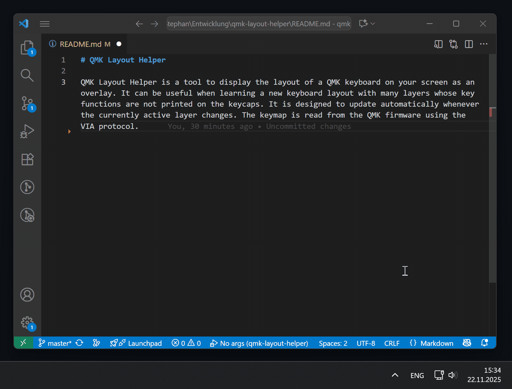
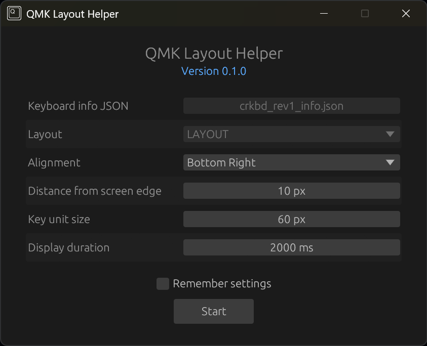

# QMK Layout Helper 

QMK Layout Helper provides a live on‑screen overlay of your keyboard, mirroring the active base and momentary layers. It is especially helpful when learning complex multi‑layer layouts or using boards with missing legends. The overlay updates instantly on layer changes, using VIA to query the current keymap and layer state so the view always matches the firmware.

It reflects the actual active layer stack, i.e. base and momentary layers, so the shown keys always correspond to the current effective layout.



## Setup

Stock QMK does not expose layer change events to the host, so a minimal firmware change is required to send layer state updates via RAW HID.

- Add the following to your `rules.mk` file to enable VIA and RAW HID support:
  ```
  VIA_ENABLE = yes
  RAW_ENABLE = yes
  ```
- Add the following to your `config.h` file to enable active layer reporting:
  ```c
  #include "raw_hid.h"
  #include "usb_descriptor.h"
  
  // Notify VIA about layer changes
  layer_state_t layer_state_set_user(layer_state_t state) {
      uint8_t data[RAW_EPSIZE] = {0};
      data[0] = 0xFF;
      data[1] = sizeof(layer_state_t);
      memcpy(&data[2], &default_layer_state, sizeof(layer_state_t));
      memcpy(&data[2 + sizeof(layer_state_t)], &state, sizeof(layer_state_t));
      raw_hid_send(data, RAW_EPSIZE);
      return state;
  }
  ```
- Optionally, if you want the currently pressed keys to be highlighted, include the following:
  ```c
  bool process_record_user(uint16_t keycode, keyrecord_t *record) {
      static uint8_t data[RAW_EPSIZE];
      data[0] = 0xF1;
      data[1] = record->event.key.row;
      data[2] = record->event.key.col;
      data[3] = record->event.pressed ? 1 : 0;
      raw_hid_send(data, RAW_EPSIZE);
      return true;
  }
  ```
- Compile and flash the modified firmware to your keyboard
  ```sh
  qmk compile -kb <your_keyboard> -km <your_keymap>
  ```
- Obtain the keyboard information json file:
  ```sh
  qmk info -kb <your_keyboard> -m -f json > keyboard_info.json
  ```
  This is the input file for the QMK Layout Helper containing the keyboard layout information required for rendering the overlay.

## Usage

The only input required for QMK Layout Helper is the keyboard information json file obtained in the previous step. Make sure to select the correct layout for your keyboard.



When "Remember settings" is checked, the selected options will be saved to a settings.ini file. For now, if you want to change the settings, either edit the settings.ini file manually or delete it to trigger the settings window on the next launch.

# License & Attribution

Parts of this project are based on code from [the VIA project](https://github.com/the-via/app), which is licensed under the GNU General Public License v3.0.